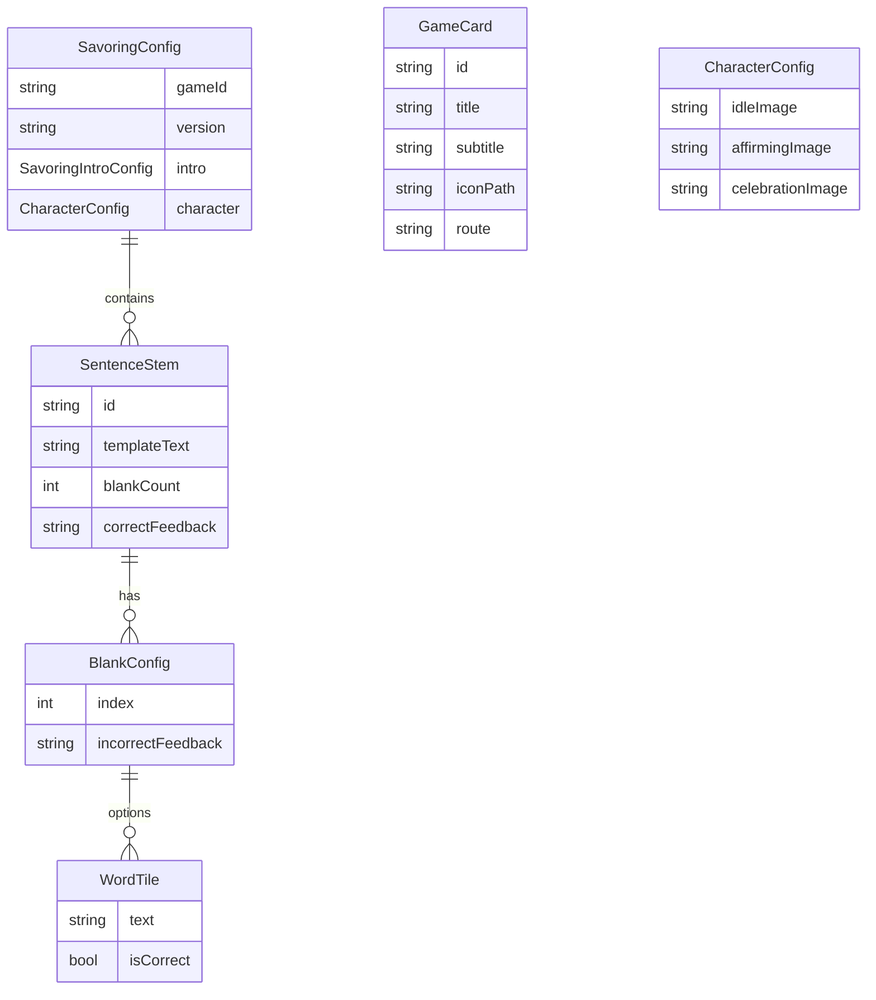

# Data Model: Savoring Game & Multi-Game Architecture

**Feature**: 002-savoring-game
**Date**: 2025-12-13

## Entity Overview



---

## Core Entities

### SavoringConfig

Root configuration for the Savoring Choice Game, loaded from JSON.

| Field | Type | Description | Validation |
|-------|------|-------------|------------|
| `gameId` | String | Unique identifier | Required, non-empty |
| `version` | String | Config version | Required |
| `intro` | SavoringIntroConfig | Intro screen content | Required |
| `character` | CharacterConfig | Character image paths | Required |
| `stems` | List\<SentenceStem\> | All 10 sentence stems | Required, length >= 10 |

---

### SavoringIntroConfig

Configuration for the savoring game intro screen.

| Field | Type | Description | Validation |
|-------|------|-------------|------------|
| `title` | String | Screen title | Required |
| `conceptText` | List\<String\> | Educational paragraphs | Required, non-empty |
| `benefitText` | String | Benefit statement | Required |
| `scientificTitle` | String | Expandable section title | Required |
| `scientificContent` | String | Scientific background | Required |

---

### SentenceStem

A sentence with blanks to be filled by dragging word tiles.

| Field | Type | Description | Validation |
|-------|------|-------------|------------|
| `id` | String | Unique identifier | Required, unique |
| `templateText` | String | Sentence with blank markers | Required, contains `{1}` or `{2}` markers |
| `blankCount` | int | Number of blanks (1 or 2) | Required, 1 <= value <= 2 |
| `blanks` | List\<BlankConfig\> | Configuration per blank | Required, length = blankCount |
| `correctFeedback` | String | Message on all blanks correct | Required |

**Blank Markers**: Use `{1}` and `{2}` in templateText to indicate blank positions.

---

### BlankConfig

Configuration for a single blank within a sentence stem.

| Field | Type | Description | Validation |
|-------|------|-------------|------------|
| `index` | int | Blank number (1 or 2) | Required, 1 <= value <= 2 |
| `tiles` | List\<WordTile\> | Available word options | Required, length = 3 |
| `incorrectFeedback` | String | Message when wrong tile selected | Required |

---

### WordTile

A draggable word option for a blank.

| Field | Type | Description | Validation |
|-------|------|-------------|------------|
| `text` | String | The word or phrase | Required, non-empty |
| `isCorrect` | bool | Whether this is the savoring choice | Required, exactly one true per BlankConfig |

---

### CharacterConfig

Character image paths for different states.

| Field | Type | Description | Validation |
|-------|------|-------------|------------|
| `idleImage` | String | Asset path for idle state | Required |
| `affirmingImage` | String | Asset path for correct answer | Required |
| `celebrationImage` | String | Asset path for completion | Required |

---

### GameCard

UI model for welcome screen game cards.

| Field | Type | Description | Validation |
|-------|------|-------------|------------|
| `id` | String | Unique game identifier | Required |
| `title` | String | Game name for display | Required |
| `subtitle` | String | Brief description | Optional |
| `iconEmoji` | String | Emoji icon | Required |
| `route` | String | Navigation route | Required, valid route |

---

## State Entities (Runtime)

### SavoringSessionState

BLoC state for an active savoring game session.

| Field | Type | Description |
|-------|------|-------------|
| `currentStemIndex` | int | Current stem (0-9) |
| `currentBlankIndex` | int | Current blank being filled (0 or 1) |
| `blank1Filled` | bool | Whether blank 1 is correctly filled |
| `selectedTiles` | Map\<int, WordTile?\> | Selected tiles per blank |
| `roundComplete` | bool | Both blanks filled correctly |
| `showingFeedback` | bool | Currently showing feedback message |
| `isFirstPlay` | bool | First-ever play (for glow hint) |
| `feedbackMessage` | String | Current feedback text |

---

## JSON Config Schema

### savoring.json Structure

```json
{
  "gameId": "savoring-choice",
  "version": "1.0",
  "intro": {
    "title": "Savoring Choice",
    "conceptText": [
      "Good moments happen all the time—but we don't always let them in.",
      "This game helps you practice noticing the good and letting it stay a little longer."
    ],
    "benefitText": "The interpretation you choose shapes how you feel and what you do.",
    "scientificTitle": "📚 Scientific Background",
    "scientificContent": "Research shows that savoring—intentionally noticing and appreciating positive experiences—can increase well-being and resilience."
  },
  "character": {
    "idleImage": "assets/images/savoring/character_idle.png",
    "affirmingImage": "assets/images/savoring/character_affirming.png",
    "celebrationImage": "assets/images/savoring/character_celebration.png"
  },
  "stems": [
    {
      "id": "stem-1",
      "templateText": "It's okay to {1}",
      "blankCount": 1,
      "blanks": [
        {
          "index": 1,
          "tiles": [
            { "text": "enjoy this moment", "isCorrect": true },
            { "text": "keep moving", "isCorrect": false },
            { "text": "focus on what's wrong", "isCorrect": false }
          ],
          "incorrectFeedback": "That focuses away from the good. Try again."
        }
      ],
      "correctFeedback": "You let the moment stay."
    },
    {
      "id": "stem-5",
      "templateText": "I can {1} this moment {2}.",
      "blankCount": 2,
      "blanks": [
        {
          "index": 1,
          "tiles": [
            { "text": "appreciate", "isCorrect": true },
            { "text": "dismiss", "isCorrect": false },
            { "text": "rush", "isCorrect": false }
          ],
          "incorrectFeedback": "That doesn't bring you closer. Try another."
        },
        {
          "index": 2,
          "tiles": [
            { "text": "fully", "isCorrect": true },
            { "text": "briefly", "isCorrect": false },
            { "text": "less", "isCorrect": false }
          ],
          "incorrectFeedback": "That cuts the moment short. Try another."
        }
      ],
      "correctFeedback": "You made space for the good."
    }
  ]
}
```

---

## Relationships

| Relationship | From | To | Cardinality |
|-------------|------|-----|-------------|
| Contains | SavoringConfig | SentenceStem | 1:N (1:10) |
| Has | SentenceStem | BlankConfig | 1:N (1:2) |
| Options | BlankConfig | WordTile | 1:N (1:3) |
| Has | SavoringConfig | CharacterConfig | 1:1 |
| Has | SavoringConfig | SavoringIntroConfig | 1:1 |

---

## Validation Rules

1. **SavoringConfig**: Must have at least 10 stems
2. **SentenceStem**: `blankCount` must match `blanks.length`
3. **SentenceStem**: `templateText` must contain `{1}` (and `{2}` if blankCount=2)
4. **BlankConfig**: Exactly one `WordTile.isCorrect = true` per blank
5. **BlankConfig**: Must have exactly 3 tiles
6. **CharacterConfig**: All image paths must be valid asset paths

---

## State Transitions

### SavoringBLoC State Machine

```
Initial
  ├── StartGame → RoundActive (stem 0, blank 0)
  │
RoundActive
  ├── TileDropped (correct, single-blank) → FeedbackShowing
  ├── TileDropped (correct, blank 1 of 2) → RoundActive (blank 1 unlocked)
  ├── TileDropped (correct, blank 2 of 2) → FeedbackShowing
  ├── TileDropped (incorrect) → RoundActive (tile returns)
  │
FeedbackShowing
  ├── [1.5s timer] stem < 9 → RoundActive (next stem)
  ├── [1.5s timer] stem = 9 → GameComplete
  │
GameComplete
  └── Finish → (navigate to welcome)
```
