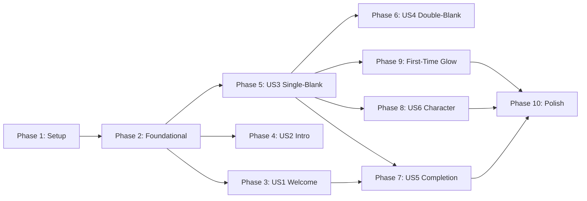

# Tasks: Savoring Game & Multi-Game Architecture

**Input**: Design documents from `/specs/002-savoring-game/`
**Prerequisites**: plan.md ✅, spec.md ✅, research.md ✅, data-model.md ✅, quickstart.md ✅

**Tests**: TDD approach required per Constitution III. Tests written FIRST, implementation SECOND.

**Organization**: Tasks grouped by user story (6 stories from spec.md).

## Format: `[ID] [P?] [Story] Description`

- **[P]**: Can run in parallel (different files, no dependencies)
- **[Story]**: Which user story this task belongs to (US1-US6)
- Include exact file paths in descriptions

## Path Conventions

- **Flutter project**: `lib/` for source, `test/` for tests
- **Configs**: `assets/configs/`
- **Images**: `assets/images/`

---

## Phase 1: Setup (Shared Infrastructure)

**Purpose**: Project setup, app renaming, routing infrastructure

- [x] T001 Rename `WorryFearApp` to `MindGOApp` in `lib/main.dart`
- [x] T002 Update app title to "MindGO" in `lib/main.dart`
- [x] T003 Add route `/welcome` as initial route in `lib/main.dart`
- [x] T004 [P] Add `AppBlocObserver` for debugging in `lib/core/utils/app_bloc_observer.dart`
- [x] T005 [P] Create placeholder character images in `assets/images/savoring/` (idle, affirming, celebration)
- [x] T006 Register new asset paths in `pubspec.yaml`

---

## Phase 2: Foundational (Blocking Prerequisites)

**Purpose**: Core models and config that ALL user stories depend on

**⚠️ CRITICAL**: No user story tasks can begin until this phase is complete

### Tests First (TDD)

- [x] T007 [P] Write unit test for `WordTile` model in `test/unit/domain/models/word_tile_test.dart`
- [x] T008 [P] Write unit test for `SentenceStem` model in `test/unit/domain/models/sentence_stem_test.dart`
- [x] T009 [P] Write unit test for `SavoringConfig` model in `test/unit/domain/models/savoring_config_test.dart`
- [x] T010 Write unit test for `SavoringConfigLoader` in `test/unit/domain/services/savoring_config_loader_test.dart`

### Implementation (Make Tests Pass)

- [x] T011 [P] Create `WordTile` model in `lib/domain/models/word_tile.dart`
- [x] T012 [P] Create `BlankConfig` model in `lib/domain/models/blank_config.dart`
- [x] T013 Create `SentenceStem` model in `lib/domain/models/sentence_stem.dart` (depends on T011, T012)
- [x] T014 Create `SavoringConfig` model in `lib/domain/models/savoring_config.dart` (depends on T013)
- [x] T015 Create `SavoringConfigLoader` service in `lib/domain/services/savoring_config_loader.dart`
- [x] T016 Create `savoring.json` config with 10 stems in `assets/configs/savoring.json`
- [x] T017 Run all foundational tests: `flutter test test/unit/domain/`

**Checkpoint**: Foundation ready - all models parse and validate correctly

---

## Phase 3: User Story 1 - App Launch and Game Selection (Priority: P1) 🎯 MVP

**Goal**: Users launch app, see welcome screen with 2 game cards, tap to navigate to game intro screens

**Independent Test**: `flutter test test/widget/welcome_screen_test.dart` + `flutter test test/widget/game_card_test.dart`

### Tests First (TDD)

- [x] T018 [P] [US1] Write widget test for `GameCard` in `test/widget/game_card_test.dart`
- [x] T019 [P] [US1] Write widget test for `WelcomeScreen` in `test/widget/welcome_screen_test.dart`

### Implementation (Make Tests Pass)

- [x] T020 [P] [US1] Create `GameCard` widget in `lib/presentation/widgets/game_card.dart`
- [x] T021 [US1] Create `WelcomeScreen` in `lib/presentation/screens/welcome_screen.dart` (depends on T020)
- [x] T022 [US1] Add route `/good-moments/intro` for existing game in `lib/main.dart`
- [x] T023 [US1] Add route `/savoring/intro` for savoring game in `lib/main.dart`
- [x] T024 [US1] Update existing `CompletionScreen` to navigate to `/welcome` on Finish
- [x] T025 [US1] Add logging for game selection in `WelcomeScreen`
- [x] T026 [US1] Run US1 tests: `flutter test test/widget/welcome_screen_test.dart test/widget/game_card_test.dart`

**Checkpoint**: App launches to welcome screen, both game cards display, tapping navigates correctly

---

## Phase 4: User Story 2 - Savoring Game Intro Screen (Priority: P2)

**Goal**: Users see savoring intro with character, educational content, Start button, expandable science section

**Independent Test**: `flutter test test/widget/savoring_intro_screen_test.dart`

### Tests First (TDD)

- [ ] T027 [P] [US2] Write widget test for `SavoringIntroScreen` in `test/widget/savoring_intro_screen_test.dart`

### Implementation (Make Tests Pass)

- [ ] T028 [P] [US2] Create `SavoringIntroScreen` in `lib/presentation/screens/savoring_intro_screen.dart`
- [ ] T029 [US2] Connect intro screen to `SavoringConfig` for content
- [ ] T030 [US2] Reuse `ExpandableSection` widget for scientific background
- [ ] T031 [US2] Add route `/savoring/gameplay` for gameplay transition
- [ ] T032 [US2] Add logging for intro screen navigation
- [ ] T033 [US2] Run US2 tests: `flutter test test/widget/savoring_intro_screen_test.dart`

**Checkpoint**: Savoring intro displays correctly, Start navigates to gameplay

---

## Phase 5: User Story 3 - Single-Blank Gameplay (Priority: P2)

**Goal**: Users complete sentences with 1 blank and 3 tile options, correct/incorrect feedback

**Independent Test**: Play single-blank stems, verify drag-drop, feedback, round advancement

### Tests First (TDD)

- [ ] T034 [P] [US3] Write widget test for `WordTileWidget` in `test/widget/word_tile_widget_test.dart`
- [ ] T035 [P] [US3] Write widget test for `BlankZone` in `test/widget/blank_zone_test.dart`
- [ ] T036 [P] [US3] Write widget test for `SentenceDisplay` in `test/widget/sentence_display_test.dart`
- [ ] T037 [US3] Write unit test for `SavoringCubit` in `test/unit/application/savoring_cubit_test.dart`

### Implementation (Make Tests Pass)

- [ ] T038 [P] [US3] Create `WordTileWidget` with Draggable in `lib/presentation/widgets/word_tile_widget.dart`
- [ ] T039 [P] [US3] Create `BlankZone` with DragTarget in `lib/presentation/widgets/blank_zone.dart`
- [ ] T040 [US3] Create `SentenceDisplay` widget in `lib/presentation/widgets/sentence_display.dart` (depends on T039)
- [ ] T041 [US3] Create `SavoringCubit` with states in `lib/application/savoring/savoring_cubit.dart`
- [ ] T042 [US3] Create `SavoringState` with equatable in `lib/application/savoring/savoring_state.dart`
- [ ] T043 [US3] Create `SavoringGameplayScreen` in `lib/presentation/screens/savoring_gameplay_screen.dart`
- [ ] T044 [US3] Add haptic feedback on tile drop using existing `HapticService`
- [ ] T045 [US3] Add audio feedback on correct/incorrect using existing `AudioService`
- [ ] T046 [US3] Add 1.5s auto-advance timer after correct answer
- [ ] T047 [US3] Add logging for tile drops and round transitions
- [ ] T048 [US3] Run US3 tests: `flutter test test/widget/word_tile_widget_test.dart test/widget/blank_zone_test.dart test/widget/sentence_display_test.dart test/unit/application/savoring_cubit_test.dart`

**Checkpoint**: Single-blank gameplay works: drag tile, get feedback, round advances

---

## Phase 6: User Story 4 - Double-Blank Gameplay (Priority: P2)

**Goal**: Users complete sentences with 2 blanks; Blank 2 locked until Blank 1 correct

**Independent Test**: Play double-blank stems, verify Blank 2 locked, then unlocks after Blank 1

### Tests First (TDD)

- [ ] T049 [US4] Add double-blank test cases to `test/unit/application/savoring_cubit_test.dart`
- [ ] T050 [US4] Add locked state test cases to `test/widget/blank_zone_test.dart`

### Implementation (Make Tests Pass)

- [ ] T051 [US4] Add `isLocked` property to `BlankZone` widget in `lib/presentation/widgets/blank_zone.dart`
- [ ] T052 [US4] Add dimmed/locked visual state in `BlankZone`
- [ ] T053 [US4] Update `SavoringCubit` to track blank1Filled state
- [ ] T054 [US4] Update `SavoringCubit` to unlock Blank 2 when Blank 1 is correct
- [ ] T055 [US4] Update `SentenceDisplay` to render numbered blanks {1} and {2}
- [ ] T056 [US4] Add separate tile groups per blank in `SavoringGameplayScreen`
- [ ] T057 [US4] Run US4 tests: `flutter test test/unit/application/savoring_cubit_test.dart test/widget/blank_zone_test.dart`

**Checkpoint**: Double-blank gameplay works: Blank 2 locked, unlocks after Blank 1 correct

---

## Phase 7: User Story 5 - Savoring Game Completion (Priority: P3)

**Goal**: After 10 stems, completion screen with character celebration and Finish button

**Independent Test**: Complete all 10 rounds, verify completion screen displays correctly

### Tests First (TDD)

- [ ] T058 [P] [US5] Write widget test for `SavoringCompletionScreen` in `test/widget/savoring_completion_screen_test.dart`

### Implementation (Make Tests Pass)

- [ ] T059 [P] [US5] Create `SavoringCompletionScreen` in `lib/presentation/screens/savoring_completion_screen.dart`
- [ ] T060 [US5] Add route `/savoring/completion` in `lib/main.dart`
- [ ] T061 [US5] Update `SavoringCubit` to emit `GameComplete` state after stem 10
- [ ] T062 [US5] Navigate from gameplay to completion when game complete
- [ ] T063 [US5] Add Finish button that returns to `/welcome`
- [ ] T064 [US5] Add celebration audio on completion
- [ ] T065 [US5] Run US5 tests: `flutter test test/widget/savoring_completion_screen_test.dart`

**Checkpoint**: Completion screen appears after 10 rounds, Finish returns to welcome

---

## Phase 8: User Story 6 - Character Behavior (Priority: P3)

**Goal**: Character shows idle (breathing), affirming (correct), no reaction (incorrect), celebration (complete)

**Independent Test**: Observe character expressions during gameplay states

### Tests First (TDD)

- [ ] T066 [P] [US6] Write widget test for `CharacterWidget` in `test/widget/character_widget_test.dart`

### Implementation (Make Tests Pass)

- [ ] T067 [P] [US6] Create `CharacterWidget` with idle state in `lib/presentation/widgets/character_widget.dart`
- [ ] T068 [US6] Add breathing animation using `AnimationController` with `SingleTickerProviderStateMixin`
- [ ] T069 [US6] Add `RepaintBoundary` around character for 60fps performance
- [ ] T070 [US6] Add affirming expression transition on correct answer
- [ ] T071 [US6] Add AnimatedSwitcher for smooth expression crossfade
- [ ] T072 [US6] Integrate `CharacterWidget` into `SavoringGameplayScreen`
- [ ] T073 [US6] Add celebration expression in `SavoringCompletionScreen`
- [ ] T074 [US6] Run US6 tests: `flutter test test/widget/character_widget_test.dart`

**Checkpoint**: Character displays correct expressions for all game states

---

## Phase 9: User Story 3 Enhancement - First-Time Glow (Priority: P3)

**Goal**: First-ever play shows glow on correct tile for Round 1, never appears again

**Independent Test**: First launch shows glow, second launch does not

### Tests First (TDD)

- [ ] T075 [US3] Add first-time glow test cases to `test/widget/word_tile_widget_test.dart`
- [ ] T076 [US3] Write unit test for first-time flag persistence in `test/unit/domain/services/first_time_service_test.dart`

### Implementation (Make Tests Pass)

- [ ] T077 [P] [US3] Create `FirstTimeService` using SharedPreferences in `lib/domain/services/first_time_service.dart`
- [ ] T078 [US3] Add glow effect to `WordTileWidget` when `showGlow: true`
- [ ] T079 [US3] Add 0.5s delay before glow appears
- [ ] T080 [US3] Hide glow when any tile picked up (onDragStarted)
- [ ] T081 [US3] Update `SavoringCubit` to check first-time flag on game start
- [ ] T082 [US3] Mark first-time as complete after Round 1
- [ ] T083 [US3] Run first-time glow tests: `flutter test test/widget/word_tile_widget_test.dart test/unit/domain/services/first_time_service_test.dart`

**Checkpoint**: First-time glow appears once and never again

---

## Phase 10: Polish & Cross-Cutting Concerns

**Purpose**: Final integration, quality assurance, documentation

- [ ] T084 [P] Write integration test for complete savoring flow in `test/integration/savoring_flow_test.dart`
- [ ] T085 Run full integration test: `flutter test test/integration/savoring_flow_test.dart`
- [ ] T086 Run all tests: `flutter test`
- [ ] T087 Run linter: `flutter analyze`
- [ ] T088 [P] Update quickstart.md with actual test commands
- [ ] T089 [P] Add DartDoc comments to all new public classes
- [ ] T090 Verify 60fps animations using Flutter DevTools
- [ ] T091 Manual testing on physical device (see Verification Plan in plan.md)
- [ ] T092 Code cleanup: Remove any TODO comments, unused imports
- [ ] T093 Final regression test of existing game: `flutter test test/widget/intro_screen_test.dart test/widget/completion_screen_test.dart`

---

## Dependencies & Execution Order

### Phase Dependencies



### User Story Dependencies

| Story | Can Start After | Notes |
|-------|-----------------|-------|
| US1 (Welcome) | Phase 2 Complete | No dependencies on other stories |
| US2 (Intro) | Phase 2 Complete | Can parallelize with US1 |
| US3 (Single-Blank) | Phase 2 Complete | Core gameplay, blocks US4, US6 |
| US4 (Double-Blank) | US3 Complete | Extends US3 mechanics |
| US5 (Completion) | US1 + US3 Partial | Needs navigation + game logic |
| US6 (Character) | US3 Partial | Needs gameplay screen to integrate |

### Parallel Opportunities Within Phases

**Phase 2** (Foundational):

- T007, T008, T009 can run in parallel (model tests)
- T011, T012 can run in parallel (models)

**Phase 3** (US1):

- T018, T019 can run in parallel (tests)
- T020 can run in parallel with tests (different files)

**Phase 5** (US3):

- T034, T035, T036 can run in parallel (widget tests)
- T038, T039 can run in parallel (widgets)

---

## Parallel Example: Phase 5 (US3 Single-Blank)

```bash
# Session 1: Run tests in parallel
flutter test test/widget/word_tile_widget_test.dart &
flutter test test/widget/blank_zone_test.dart &
flutter test test/widget/sentence_display_test.dart &
wait

# Session 2: Implement widgets in parallel
# Task: Create WordTileWidget in lib/presentation/widgets/word_tile_widget.dart
# Task: Create BlankZone in lib/presentation/widgets/blank_zone.dart
```

---

## Implementation Strategy

### MVP First (User Story 1 + Partial US3)

1. Complete Phase 1: Setup ✓
2. Complete Phase 2: Foundational ✓
3. Complete Phase 3: US1 (Welcome Screen) ✓
4. **STOP and VALIDATE**: App launches to welcome, cards navigate
5. Start Phase 5: US3 (core gameplay only)
6. **Demo-ready** after US3 with 1 single-blank stem

### Incremental Delivery

| Milestone | Stories Complete | User Value |
|-----------|------------------|------------|
| MVP | US1 + US3 (partial) | Can play basic game |
| Alpha | US1 + US2 + US3 | Full single-blank gameplay |
| Beta | + US4 + US5 | Full gameplay + completion |
| Release | + US6 + Glow | Polished experience |

---

## Summary Statistics

| Metric | Count |
|--------|-------|
| Total Tasks | 93 |
| Setup Tasks | 6 |
| Foundational Tasks | 11 |
| User Story Tasks | 66 |
| Polish Tasks | 10 |
| Parallelizable [P] Tasks | 28 |

### Tasks Per User Story

| Story | Tests | Implementation | Total |
|-------|-------|----------------|-------|
| US1 (Welcome) | 2 | 7 | 9 |
| US2 (Intro) | 1 | 6 | 7 |
| US3 (Single-Blank) | 4 + 2 | 10 + 7 | 23 |
| US4 (Double-Blank) | 2 | 5 | 7 |
| US5 (Completion) | 1 | 6 | 7 |
| US6 (Character) | 1 | 7 | 8 |

---

## Notes

- [P] tasks = different files, no dependencies on incomplete tasks
- [Story] label maps task to specific user story for traceability
- TDD required: Write tests FIRST, verify they FAIL, then implement
- Commit after each task or logical group
- Stop at any checkpoint to validate story independently
- Use `buildWhen` in BlocBuilder for selective rebuilds (per research.md)
- Use `ValueKey` for tile lists (per research.md)
- Reuse: ProgressBar, ExpandableSection, AudioService, HapticService, AppColors
